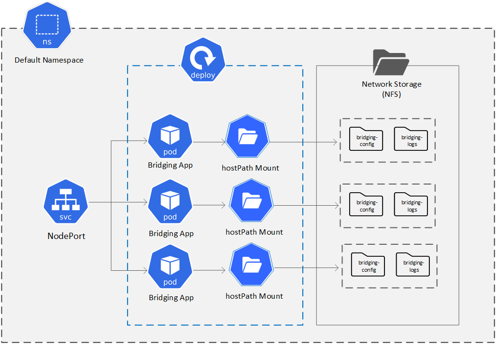

# Bridging Helm Chart
###Objective: 
To deploy Bridging application cluster as a Helm chart along with its dependencies.
The Bridging application depends on following components:
-	Cassandra DB
-	Elastic stack (FileBeat/Logstash, Elastic DB, Kibana)
-	Kafka (optional)

### Pre-requisite:
-	The Bridging app needs to read the configuration files during the startup. It also needs to write information to the application log files. 
-	The config files are read from a shared network folder. Similarly, the log files are written to a shared folder.  
-	The NFS shared folder `/mnt/nfs_share/` is used for this purpose. 
-	Please ensure that the NFS folder is available and can be accessilble from all the hosts in the k8s cluster.

### Architecture



### Kubernetes / Helm Chart Manifests:

##### Chart Dependencies
-	The chart.yaml should specify dependency on following packages / charts
	-	**cassandra-chart** (Refer [here](https://helm.sh/docs/helm/helm_dependency) for details)
		-	The 'name' should exactly match the name in the dependant chart's `Chart.yaml` file.
		-	The repository path of the dependant chart can be a URL or a local path. 
	-	....

##### Deployment
	-	The container image used is [bitnami/cassandra](https://hub.docker.com/r/bitnami/cassandra) version / tag 5.0
		
-	*volumeMounts*
	An NFS shared folder is mounted as hostPath
	The NFS folder stores the Bridging configuration and log files

##### NodePort Service
-	The NodePort service is used to expose the Bridging APIs to the outside world using specific ports.
-	The NodePort service also works as a load balancer to distrubute the requests among the participateing Pods.

### Configuration:

Please refer to `values.yaml` file for configurable parameters.

### Install Chart:
Go to working directory
`$ cd /home/eabhgad/workspace/git/helm-charts`

Validate if all the manifests before installation: 
`helm install bridging ./bridging-chart --dry-run`
where,
`bridging`  = Release name

Build / Rebuild the chart dependencies first:
```
helm dependency build ./bridging-chart
helm dependency update ./bridging-chart
```

Install the chart:

`helm install bridging ./bridging-chart`

Check the status of Chart (along with the associated resources):

`helm status bridging --show-resources`

### Verify Installation:
Ensure that all the required objects are created and running:

`kubectl get all -l=app=bridging`

Ensure that the Bridging Lookup API is working:

`curl -i -X GET "http://192.168.30.3:32121/bridging/lookup/account?type=MSISDN&identifier=11111111111"`

### Cleanup:
To delete all the objects created by the chart
`helm delete bridging`
